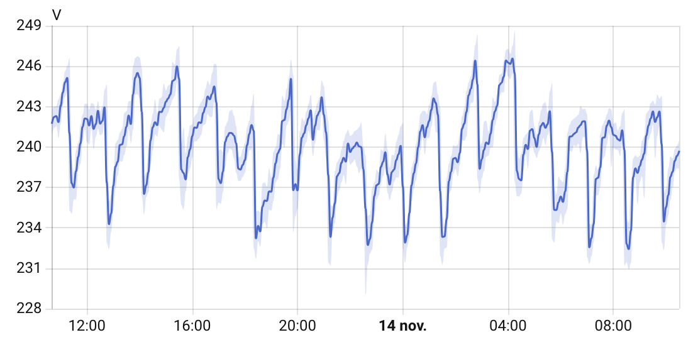

# ESPHome ZMPT101B Sensor

## Introduction

This is an ESPHome external component for measuring AC RMS voltage using the ZMPT101B voltage sensor module.

This component reads the analog output of the ZMPT101B module through a defined ADC sensor and computes the true RMS voltage over one or more AC cycles.
It’s ideal for real-time monitoring of your mains power with ESP32 or ESP8266-based smart devices.

Initial source from [Abdurraziq/ZMPT101B-arduino](https://github.com/Abdurraziq/ZMPT101B-arduino), inspired by [rafal83/zmpt101b](https://github.com/rafal83/zmpt101b)

Note: It works perfectly with both the Arduino and ESP-IDF frameworks.



## Usage

```
external_components:
  - source: github://hugokernel/esphome-zmpt101b@main
    components: [zmpt101b]

sensor:
  # First, you need to declare an adc platform...
  - platform: adc
    pin: GPIO36
    id: zmpt_adc
    attenuation: 12db
    update_interval: never    # Prevent default polling, let zmpt101b handle it
    internal: true            # Hide raw ADC reading from Home Assistant

  # ...then reference the previously declared adc platform in adc_id
  - platform: zmpt101b
    name: "${friendly_name} AC Voltage RMS"
    adc_id: zmpt_adc
    frequency: 50
    sensitivity: 8.36
    measurement_duration: 100ms   # Sampling window per measurement (optional)
    update_interval: 60s          # How often to measure (optional)
```

### Configuration variables

* **adc_id** (*Required*): The ID of the `adc` sensor to read the ZMPT101B analog output from.
* **sensitivity** (*Required*, float): Calibration factor converting the analog signal to real AC voltage (see below).
* **frequency** (*Optional*, default `50`): Mains frequency in Hz. Used to align the sampling window to whole AC cycles.
* **measurement_duration** (*Optional*, default `100ms`): Duration of the single sampling pass. Longer windows average over more cycles for a more stable reading, at the cost of a longer (but non-blocking-per-loop) sample.
* **update_interval** (*Optional*, default `60s`): How often a measurement is taken and published.

### Non-blocking design

This component is a polling component: it only samples the ADC once per `update_interval`,
for the short `measurement_duration` window, instead of continuously in the main loop.
The RMS is computed in a single pass (deriving both the DC offset and the AC RMS from the
same samples), which keeps the sampling short and avoids starving other sensors, WiFi, or the API.

### Why declare the ADC sensor separately?

The zmpt101b sensor does not configure the analog pin itself.
Instead, it uses an existing adc sensor declared in the YAML via adc_id:.
This approach ensures maximum compatibility and avoids conflicts by ensures only one
component manages the ADC hardware (a limitation on ESP32/ESP8266).

### How to calibrate sensitivity

First, your sensor need to be calibrated according to [Abdurraziq/ZMPT101B-arduino#steep](https://github.com/Abdurraziq/ZMPT101B-arduino#steep)

The sensitivity value determines how the analog signal is converted into the real AC voltage.
It depends on your specific ZMPT101B module, hardware, and ADC settings (e.g., attenuation, voltage reference).

To calibrate it:

1. Start with a value around 8.0 to 10.0.
2. Compare the reported voltage in Home Assistant with a trusted multimeter measurement.
3. Adjust the sensitivity using this formula:

sensitivitycorrected = sensitivitycurrent × (Vreported / Vactual)

#### Example:

* You set sensitivity: 8.0
* ESPHome shows 270 V
* Your multimeter reads 230 V

Then:

sensitivitycorrected = 8.0 × (270 / 230) = 9.39

Update the YAML with the new value and repeat until the readings are accurate (±1V is acceptable).
